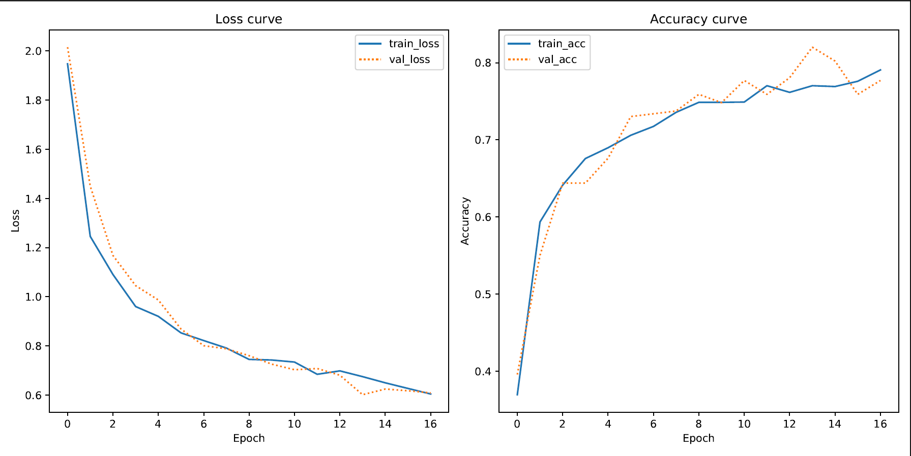

# 🕵 Document classification using pretrained image embeddings
This project explores the application of computer vision to the task of multi-class document classification. Instead of relying on linguistic features, we leverage visual features extracted by a pre-trained Convolutional Neural Network (CNN) for feature extraction, specifically the VGG16 model. The project employs transfer leaning, a technique where a model trained on one task is repurposed on a related task. Specifically through not including the final fully-connected layer at the top of the pre-trained VGG16 model. Thus, these extracted features are then fed into a custom fully-connected feed-forward neural network, which is trained to classify the documents based on the extracted characteristics. For a more detailed explanation of the model architecture, please refer to the [Model](#-model) section below.

## 📈 Data

### 📋 Dataset
The project utilizes the [Tobacco3482](https://www.kaggle.com/datasets/patrickaudriaz/tobacco3482jpg?resource=download) dataset for document classication. The dataset's individual sub folders (ADVE, Email, etc.) should be placed in the `in` directory, and can be sourced from [here](https://www.kaggle.com/datasets/patrickaudriaz/tobacco3482jpg?resource=download). Please see an overview of the dataset below:

| Folder     | Number of Files |
|------------|-----------------|
| ADVE       | 231 Files       |
| Email      | 600 Files       |
| Form       | 432 Files       |
| Letter     | 568 Files       |
| Memo       | 621 Files       |
| News       | 189 Files       |
| Note       | 202 Files       |
| Report     | 266 Files       |
| Resume     | 121 Files       |
| Scientific | 262 Files       |

**NB:** When sourcing the data from Kaggle, the zip file includes a nested copy of the entire dataset. The script is written so that this duplicate should be deleted. Alternatively, the script could've disregarded specific folder names.

### 🔨 Data Augmentation
The project presents the option to use data augmentation. The data augmentation is performed using the `ImageDataGenerator` class from the `tensorflow.keras.preprocessing.image` module. Please refer to the default configuration below:

```py
ImageDataGenerator(
    rotation_range=20,
    fill_mode="nearest",
    brightness_range=[0.8, 1.2],
    horizontal_flip=True,
    validation_split=0.1,
)
```

### 🤖 Model

The model used in this project is a combination of a pre-trained VGG16 model and a custom fully-connected feed-forward neural network. The VGG16 model is used for feature extraction, while the custom neural network is used for document classification. The VGG16 model is used without its final fully-connected layer: This allows us to disregard its specific classification layer, and use the concept of transfer learning to leverage the model's feature extraction coupled with a custom neural network.

By default when you run the project's main script, the model architecture includes a BatchNormalization layer, as well as a Dropout layer after the first dense layer. The first dense layer utilizes a RELU activation function. The final layer is a dense layer with 10 neurons using a softmax activation function to predict the document's label.

By default, the project uses the Adam optimizer to update the weights of the model during training, with the goal of minimizing the loss function.


#### 📝 Model Summary
Please refer to the following table for the model layers, excluding the pre-trained VGG16 model. 
| Layer (type)                 | Output Shape         | Param #   |
|------------------------------|----------------------|-----------|
| flatten (Flatten)            | (None, 512)          | 0         |
| batch_normalization (BatchNormalization) | (None, 512) | 2,048 |
| dense (Dense)                | (None, 128)          | 65,664    |
| dropout (Dropout)            | (None, 128)          | 0         |
| dense_1 (Dense)              | (None, 10)           | 1,290     |

**Total params**: 14,919,647 (56.91 MB)
**Trainable params**: 67,978 (265.54 KB)
**Non-trainable params**: 14,715,712 (56.14 MB)
**Optimizer params**: 135,957 (531.09 KB)

## 📂 Project structure
```
└── transfer_learning_pretrained_cnns
    ├── in/
    │
    ├── out/
    │    ├── models/
    │    ├── VGG16_tobacco_plot.pdf
    │    └── VGG16_tobacco_report.txt
    │
    ├── src/
    │    ├── document_classification.py
    │    └── utilities/
    │         ├── data_processing_utilities.py
    │         ├── logging_utilities.py
    │         ├── model_compilation_utilities.py
    │         └── plotting_utilities.py
    │        
    ├── README.md
    ├── requirements.txt
    ├── setup_unix.sh
    └── setup_win.sh
```

## ⚙️ Setup
To set up the project, you need to create a virtual environment and install the required packages. You can do this by running the appropriate setup script for your operating system.

### 🐍 Dependencies
Please ensure you have the following dependencies installed on your system:
- **Python**: `version 3.12.3`

### 💾 Installation
1. Clone the repository
```sh
git clone https://github.com/apathriel/cds-vis-analytics
```
2. Navigate to the project directory
```sh
cd assignments
cd transfer_learning_pretrained_cnns
```
3. Run the setup script to install dependencies, depending on OS.
```sh
bash setup_unix.sh
```
4. Activate virtual environment (OS-specific) and run main py scripts.
```sh
source env/bin/activate
python src/document_classification.py
```

## 🚀 Usage
Once the virtual environment is set up and dependencies are installed, execute the main script `document_classification.py` with your preferred command-line options.

Running the script without the `-s` flag initiates the following sequence: Data paths are initialized and image data is loaded, model architecture is defined, training data is split, and the model is trained on this data. The trained (or loaded) model then makes predictions on the test data. The classification report is saved, and the model's loss curve is visualized. If a model is loaded, the `History` object is also loaded and used for plotting.

Refer to the [CLI Reference](#-cli-reference) section for more information on the available command-line options.

### 💻 CLI Reference

The CLI is implemented through the click module - It was selected for its simplicty. The script `document_classification.py` can be run from the command line with several options:

| Option | Short | Default | Type | Description |
| --- | --- | --- | --- | --- |
| `--num_of_epochs` | `-e` | 12 | int | Number of epochs to train the model. By default, the script uses the EarlyStopping callback to prevent overfitting |
| `--batch_size` | `-b` | 128 | int | Batch size for training the model |
| `--optimizer_type` | `-o` | "Adam" | str | Type of optimizer to use. Script is written to accept either SGD or Adam |
| `--test_split_size` | `-t` | 0.2 | float | The proportion of the data to use for testing the model |
| `--print_model_summary` | `-p` | False | bool | Flag determining whether to print the model summary |
| `--use_saved_model` | `-s` | False | bool | Flag determining whether to use a saved model |
| `--model_title` | `-m` | "VGG16_tobacco_model.keras" | str | The file name of the saved model. Must be placed in `out/models` directory |

You can combine multiple options. Please refer to the example below:

```bash
python src/document_classification.py --num_of_epochs 20 --batch_size 256 -p
```

### 🧰 Utilities
- ``data_processing_utilities.py``: Contains functions for loading and preprocessing the training data, splitting the data, and binarizing the labels.
- ``model_compilation_utilities.py``: Contains functions for defining the model architecture, compiling the model, and optionally augmenting the training data.
- ``plotting_utilities.py``: Contains functions for plotting the model's training history.
- ``logging_utilities.py``: Contains function for instantiating

## 📊 Results
**NB**: The results in the classification report were obtained through loading `VGG16_tobacco_model.keras`. The model was trained using early stopping: The model ran for 17 epochs. Peforming classification with the saved model multiple times produced F1 scores within a range of 68-77. This variance is quite high: It stems from the splitting of training and test, potentially data augmentation as well. While the train_test_split was stratified, the selections differed for each run. I've selected the report from the best run. The training of the model is visualized through the loss curve and accuracy curve pictured below.

### 📈 Loss Curve



If you examine the model's loss curve, you can see train_loss and val_loss follow each other quite nicely: This suggests that the model is learning effectively from the training data and is able to generalize that knowledge to the validation data.

The model's hyperparameters were largely selected based on informed intuition and trial-and-error. The dropout layer was added to prevent overfitting. Data augmentation further prevented overfitting through diversifying the training data.

The accuracy might be further improved through manipulating the optimizer: Adam was selected based on results. Additionally, further data augmentation, further regularization, and alternate model architectures could be explored. 

### 📋 Classification Report
In order to evaluate the performance of the model, I'll primarily be looking at the F1-score, the harmonic mean of precision and recall: There's not a substantial difference between the weighted and the unweighted mean F1-score. 

Overall, the model performs quite well, considering the difficulty of the task. The model has a weighted F1-score of 0.77, which means that 77% of all classifications were correctly predicted. Generally, It exhibits higher precision than recall. This suggests that the model is more effective at correctly identifying the class, but is more likely to say something is false when it's actually true.

This is a common trade-off in the field of machine learning, and in the context of the classification task, I don't see a large issue in this discrepency. Now if this classification task considered medical diagnosis, you would prioritize a higher recall, since a false negative means not treating a disease.

While there's quite large variance between the different classes' evaluation metrics, there's also variance in the training data samples: Stratification, implented through the scikit-learn module's `train_test_split` was used to ensure that the train and test datasets have the same proportions of class labels as the input dataset.

The lack of training data samples might be the cause for the low performance of the 'News, Resume, and Scientific' classes. There could also be no correlation at all: The 'Letter' class has an F1-score of 96, while only having 36 samples. The low performance might be caused by inherent complexity, similarity to other classes, or simply unsuitable for the model architecture.

### 🔮 Conclusion 
From a cultural standpoint, the results could inform as to the visual nature of document types. These inklings would have to be explored further in order to provide concisive reflections, perhaps through (semi) manual inspection of the dataset. Although, any such reflections would have to be articulated through the lens of the model, and the dataset.

## 📖 References
- [Click GitHub repo](https://github.com/pallets/click)
- [VGG16 model](https://www.tensorflow.org/api_docs/python/tf/keras/applications/VGG16)
- [Tobacco3482 dataset on Kaggle](https://www.kaggle.com/datasets/patrickaudriaz/tobacco3482jpg?resource=download)